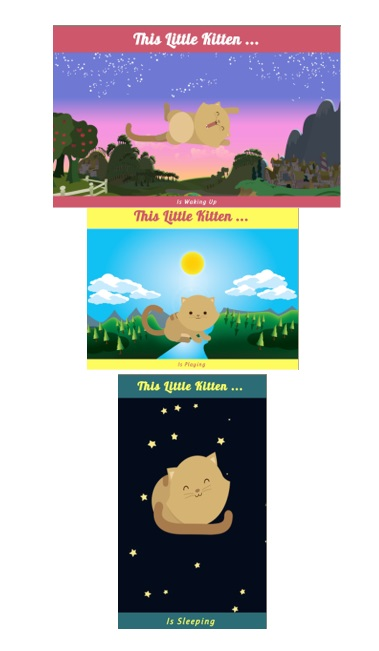

# Proyecto: Reto de Código Kitten

## Descripción del proyecto:

El siguiente repositorio contiene la realización de un site que cambia su diseño conforme disminuye el tamaño de la pantalla del dispositivo.
Para su desarrollo se utilizó una estructura semántica de HTML, la aplicación de clases mediante CSS y para mantener un diseño responsive, el uso de la regla de media queries.
Con JavaScript, se dio dinamismo a la página, ya que cambia el texto del footer de acuerdo a la variación de la imágenes.

## Herramientas utilizadas:

1. HTML5

2. CSS3

3. JS